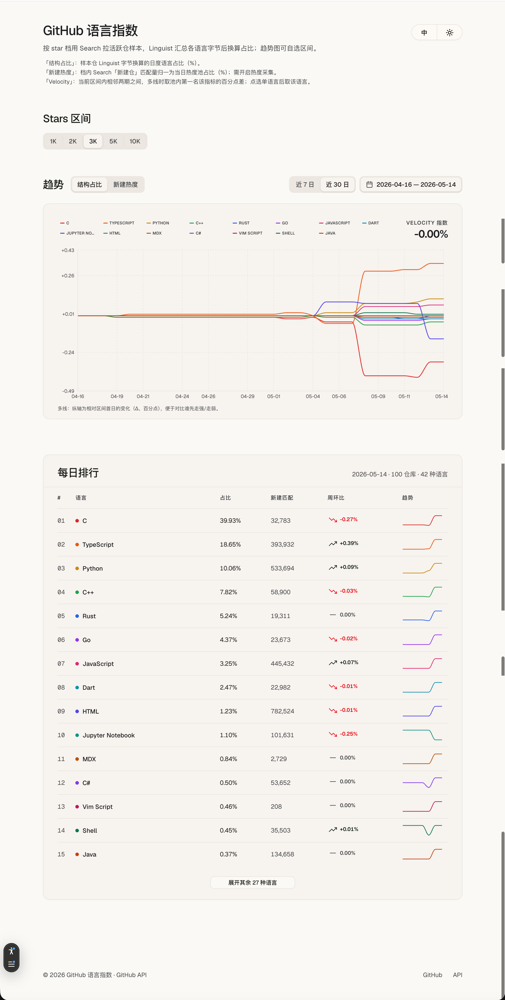

# GitHub 语言指数

在线演示：**[https://github-tiobe.vercel.app/](https://github-tiobe.vercel.app/)**

按 GitHub **Stars 区间**（1K / 2K / 3K / 5K / 10K）分别抽样「近期有 push」的公开仓库，用 **Linguist 字节统计**汇总各语言在样本内的占比，并展示趋势与每日排行。结果反映**该档位样本仓**内的语言结构，不代表全站或全 GitHub 分布。

## 统计方式

### 样本

- 每个 Stars 档位单独通过 **GitHub Search** 拉取活跃仓库样本（按 stars 排序，有单次查询上限）。
- 对样本内每个仓库调用 **`/languages`**，按 Linguist 规则汇总各语言**字节数**，再换算为**占样本总字节的百分比**。

### 页面指标

| 指标 | 含义 |
|------|------|
| **结构占比** | 当日样本仓中，各语言 Linguist 字节占样本总字节的比例（%）。趋势图默认可看近 7 / 30 日或自选日期区间。 |
| **新建热度** | 档内按 Search「新建仓」条件统计的匹配量，归一为当日**热度池**内的占比（%）；需开启热度采集后才有数据。 |
| **Velocity 指数** | 当前所选日期区间内，**相邻两个成功采集日**之间：多线视图取该指标在池内**第一名**的百分点变化；点选某一语言后，改为该语言的百分点变化。 |
| **周环比**（每日排行） | 与 **7 个自然日前**同档位成功快照相比，该语言结构占比的百分点差（Δ）。 |
| **趋势（迷你图）** | 最近若干日结构占比走势（仅排行前列语言展示）。 |

### 多线趋势图说明

未聚焦单一语言时，纵轴为各语言相对**区间首日**的 **Δ（百分点）**，便于对比谁先走强、走弱；悬停可查看当日占比与相对首日的变化。

## 说明

- 排行与趋势基于**最近一次成功采集**及保留期内的历史快照；保留天数由部署环境配置（默认约 30 日）。
- Search 与 API 有速率与结果条数限制，样本规模越大，采集耗时越长。

---

自建与定时采集可参考 [.env.example](.env.example) 与仓库内 `scripts/`、`/.github/workflows/`。
